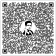

## 👋 Hello, I'm Al Mamun Hossen

Graphic Designer | Web Designer | Opentype font Developer

## 〽️ Something About Me

I am any time very happy because my country name is Bangladesh. I am an Emotional, Optimist, Challenging, Simple man, I always try my best to keep good character, I love my Parents, My Motherland is Bangladesh. I'm Working at Reem Group as a Computer IT Solution, [Ekushey](http://www.ekushey.org/) as an Artwork Graphics Designer Opentype font Developer.

- 💼 I’m currently working on [Al Reem Group](https://reemgroup.co/)
- 📗 I’m currently learning JavaScript

 

## 👨‍💻 My Skills:

✅ CREATIVE GRAPHIC DESIGN  
✅ JavaScript  
✅ HTML5 | CSS3 | SASS  
✅ WordPress  
✅ OPENTYPE FONT DEVELOPER  
-- ✅ [Fontlab](https://www.youtube.com/watch?v=IPbyZFEeCb8&list=PLN5OEA26QEnWUlZW-Qlu8YLtjiGDlKCOx) 
-- ✅ [Microsoft Volt](https://www.youtube.com/watch?v=7fXmEeGMulY&list=PLN5OEA26QEnXQVnUt-iWo2X01cZSAO-io) 
 

 

## 🤙🏼 Get in Touch

 

<!-- Git Pro Icon -->

|  |  |
| ------------------------------------------------------------------------------------------------------------------------- | ------------------------------------------------------------------------------------------------------------------------------------------------ |
